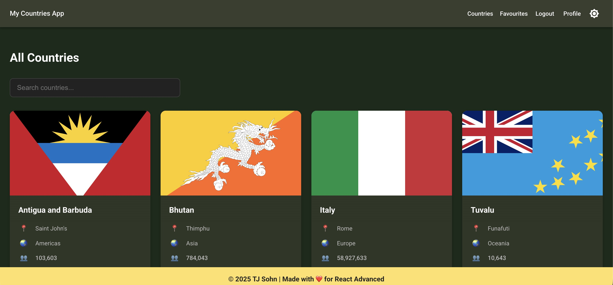
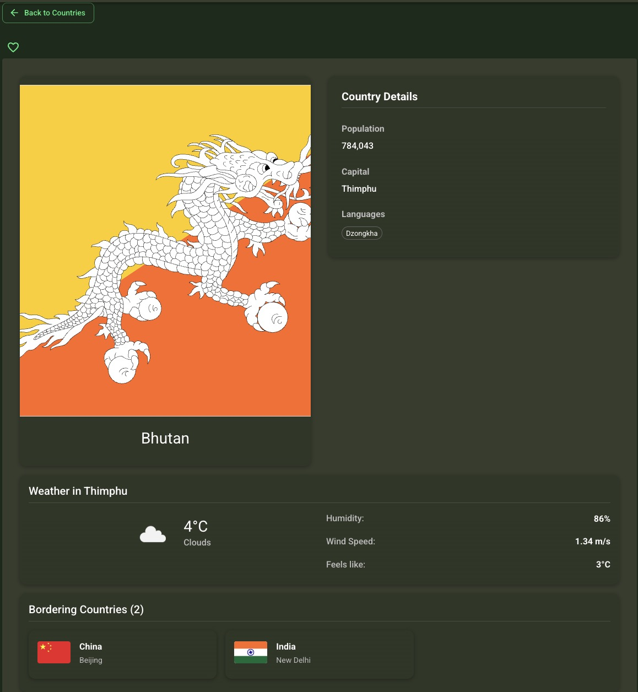
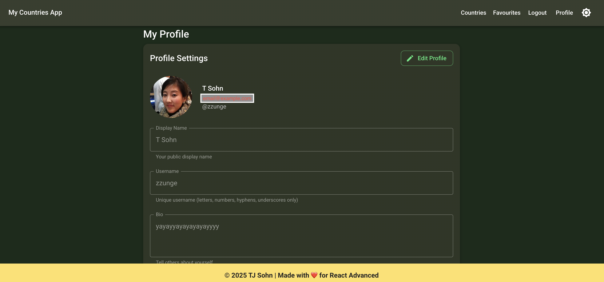

# Countries App – Next.js Project

A personalized countries explorer app built with **Next.js**, **React**, **Redux Toolkit**, **Supabase**, and **Material-UI**.  
This project was developed as part of a course assignment.  
> Initial project structure was provided by the instructor, and I implemented most UI features, search, filtering, routing, authentication flows, and dynamic content.

---

## 🚀 Features Implemented

- Search countries by name  
- Filter countries by region  
- View country details  
- Favourites with Supabase authentication  
- Email/password and Google login  
- Light/dark theme toggle  
- Sticky header & footer  
- User profile & edit profile (display name, username, avatar)  
- Dynamic routing & protected routes
- Weather info (OpenWeather API)
- Favourites analytics  

---

## 🛠️ Tech Stack

- **Next.js 14**  
- **React**  
- **Redux Toolkit**  
- **Supabase**  
- **Material-UI / Custom CSS**  
- **Axios** (API requests)

---

## 📸 Screenshots

  
  


---

## ▶️ Getting Started

1. Clone the repository  
	```bash
	git clone https://github.com/TJsohn/countries-nextjs-react25k.git
	cd countries-nextjs-react25k
	```

2. Install dependencies
	```bash
	npm install
	# or
	yarn install
	```

3. Run the development server
	```bash
	npm run dev
	# or
	yarn dev
	```

Open http://localhost:3000 in your browser

Note: Supabase/OpenWeather keys are required for full functionality. You may use your own API keys or request demo credentials from the author.

## 🔍 My Contributions
	•	Implemented UI/UX according to mockups
	•	Built search, filtering, and dynamic routing
	•	Integrated Supabase authentication for favourites
	•	Developed profile management features
	•	Ensured responsive design across devices
	•	Structured code for maintainability and reusability

⸻

## 🌐 Live Demo

[Countries Next.js App](https://countries-nextjs-react25k-ruddy.vercel.app/)(deployed version)

⸻

## 💡 What I Learned
	•	Advanced Next.js routing and dynamic pages
	•	React state management with Redux Toolkit
	•	API integration & authentication flows
	•	Responsive UI design & theme toggling
	•	Writing clean, maintainable front-end code